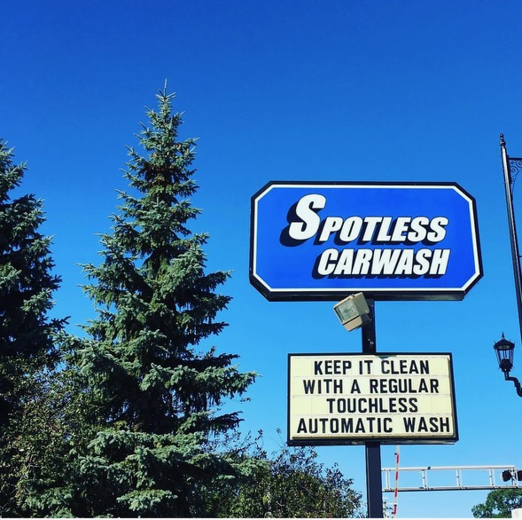

# Spotless Car Wash

Marketing and self-serve token purchase site for Spotless Car Wash (Madison St & Roosevelt Rd locations). Built with Next.js 15, Sanity, Stripe, and Tailwind.

## Screens

### Hero


### Locations



### Bays


## Stack

- **Next.js 15** (App Router) + React 18
- **Sanity** CMS (embedded Studio at `/studio`)
- **Stripe** for token purchases (`/buy-tokens`)
- **Tailwind CSS** + styled-components
- **Playwright** for e2e tests

## Getting started

```bash
yarn install
yarn dev
```

Visit http://localhost:3000.

### Environment

Create `.env.local` with Sanity and Stripe credentials (project ID, dataset, API token, Stripe secret/publishable keys).

## Scripts

| Command | Description |
| --- | --- |
| `yarn dev` | Run Next.js dev server |
| `yarn build` | Production build |
| `yarn start` | Run production build |
| `yarn lint` | ESLint |
| `yarn seed` | Seed Sanity dataset |
| `yarn test:e2e` | Run Playwright e2e tests |
| `yarn test:e2e:ui` | Playwright UI mode |

## Structure

- `app/` — routes (home, locations, buy-tokens, faq, studio, legal, API)
- `src/components/` — page sections and shared UI
- `src/data/` — static location data
- `sanity/` — schema and Studio config
- `e2e/` — Playwright tests
- `public/images/` — site imagery
